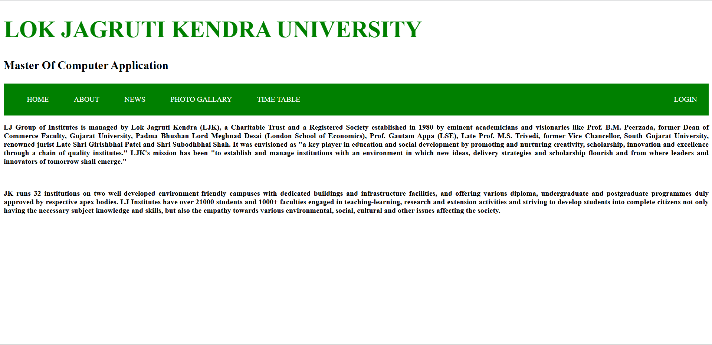
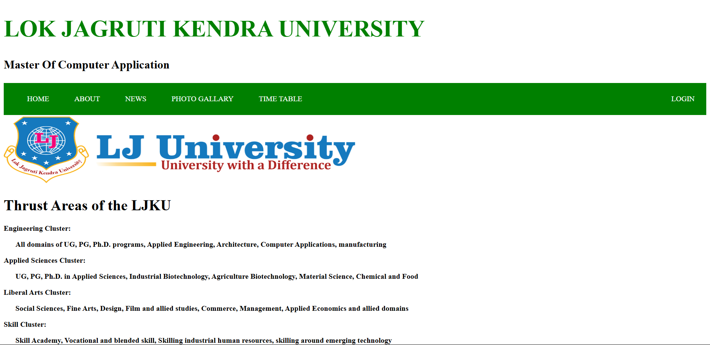
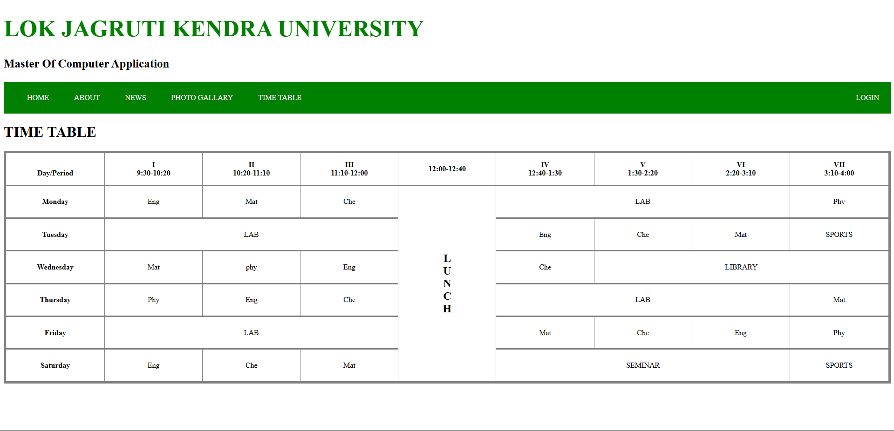
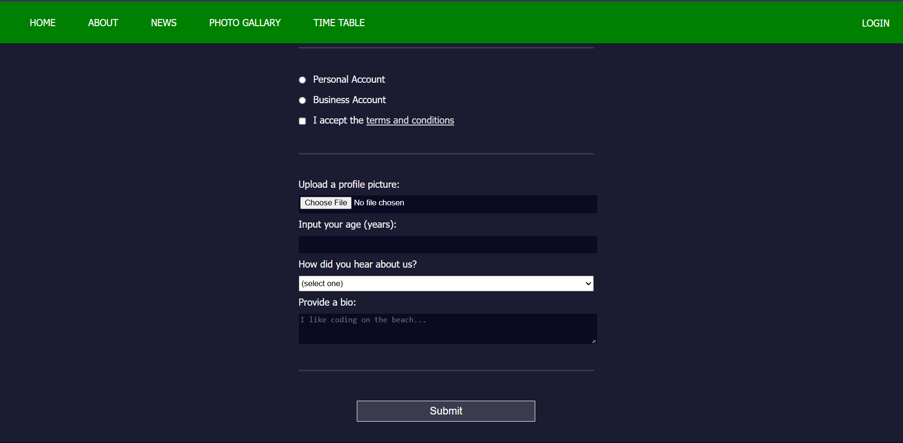

# 🌐 LOK JAGRUTI KENDRA UNIVERSITY Website (First Semester Project)

This is my **first ever web development project**, built during the **first semester** of my BCA course. The project represents a basic static website for **Lok Jagruti Kendra University**, containing multiple pages and demonstrating foundational HTML and CSS skills.

---

## 📁 Project Structure

The project includes the following pages:

- `index.html` – Homepage with university branding and navigation.
- `ABOUT.html` – About page describing thrust areas of the university.
- `NEWS.html` – Latest news section (can be expanded in the future).
- `PHOTOGALLARY.html` – A photo gallery showcasing university events.
- `TIMETABLE.html` – A sample student timetable layout.
- `LOGIN.html` – A basic registration/login form using HTML.
- `style.css` – CSS styling embedded in each page.

---

## 💻 Technologies Used

- **HTML5** – For building the structure of all pages.
- **CSS3** – For styling, layout, and hover effects.
- **No JavaScript** (as it’s a beginner-level project).

---

## ✨ Features

- Responsive-like layout with sticky navigation bar.
- Basic form validation using HTML attributes.
- Hover effects on navigation links.
- Timetable created using HTML `<table>`.
- Static photo gallery using `img` tags and CSS hover.

---

## 📸 Screenshot

### 1️⃣ Home Page  

## 2️⃣ About Page

### 3️⃣ News Page

### 3️⃣ gallery Page

### 3️⃣ Timetable Page

### 3️⃣ Login Page 1

### 3️⃣ Login Page 2

---

## 📚 What I Learned

- Structuring web pages using semantic HTML tags like `<header>`, `<nav>`, `<footer>`, `<section>`, and `<form>`.
- Using CSS for layout design, hover effects, spacing, and responsive styling.
- Creating multi-page navigation systems.
- Working with tables, forms, and images.

---

## 📦 How to Run

1. Download or clone this repository.
2. Open `index.html` in your web browser.
3. Navigate between the pages using the top navigation bar.

---

## 👨‍🎓 Developer

- **Name:** Vaghela Purvarajsinh  
- **Semester:** 1st  
- **Course:** BCA 
- **University:** Lok Jagruti Kendra University  

---

## 🔖 License

This project is for **educational purposes only**. You are free to use and modify it for learning or teaching.

